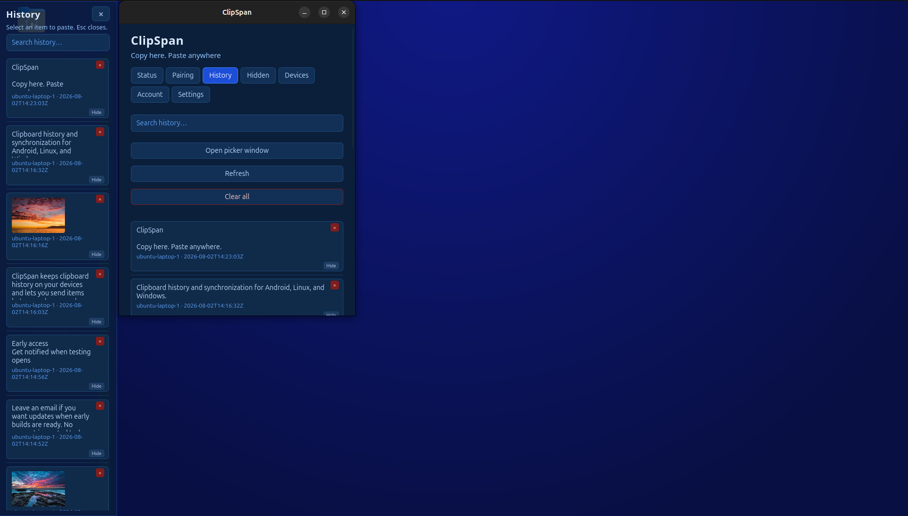
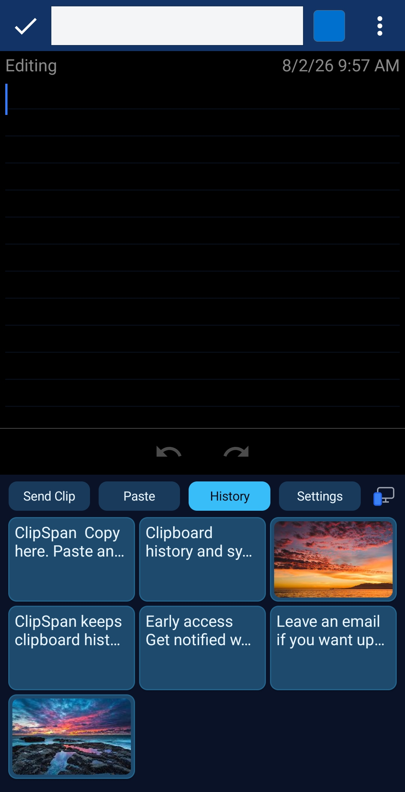

# ClipSpan : Universal Clipboard Sync

**ClipSpan** is a cross-platform clipboard history and sync system. The goal: copy or select content on Android and paste it on a Linux or Windows desktop (and vice versa), with searchable history across devices — without root access or unsafe permission workarounds.

**Status:** v0.15.x — Rust/Tauri desktop (Linux + Windows early testing), docked history picker, ClipSpan Keyboard, image/blob sync, offline-resilient history, encrypted history vault backup/restore, Hidden / Recently removed with durable purge, optional end-to-end encrypted account + relay. macOS planned.

> **Product site & early testing:** [clipspan.com](https://clipspan.com/) — current project state and waitlist for early builds when available.

---

## Overview

ClipSpan treats clipboard data as **sensitive by default** (passwords, tokens, addresses, code snippets). Local-only LAN pairing remains the default. Explicit user-controlled send/paste validates the protocol first; opt-in automatic sync and optional account/relay paths layer on after that.

Daily flows:

- Android **Send Clip** (selection action, share target, keyboard toolbar)
- Android **Paste** from history / desktop (keyboard toolbar, companion history)
- Desktop tray **Send Clip**, hotkey history picker, paste-into-focused-app
- Searchable cross-device history with hide, recently removed, undo, and clear controls

Long-term north star: frictionless install, pair, and daily paste — but privacy and user control come first.

---

## Media

Desktop and Android histories staying in sync — the product story in one frame:


<div class="media-pair">
  <figure>
    
    <figcaption>Desktop: main window and left-docked history picker</figcaption>
  </figure>
  <figure class="media-pair__phone">
    
    <figcaption>Android: companion history viewer</figcaption>
  </figure>
</div>

---

## Architecture Highlights

### Modular Layers

```text
User interface layer
Clipboard access layer
Sync protocol layer
Transport layer
Storage/history layer
Pairing/security layer
Platform adapter layer
```

Each layer is decoupled so the Android keyboard, companion app, Linux/Windows desktop client, and future macOS client can evolve independently.

### Android (Gradle Multi-Module)

- `sync-core/` : HTTP clients, protocol, Room history, sync coordinator, account client
- `sync-ime-bridge/` : fork-agnostic IME toolbar (push/pull/history, password guard)
- `companion-app/` : Connect/QR pairing, history, settings, Account screen, share targets
- `keyboard/` : **ClipSpan Keyboard** (FlorisBoard fork) with toolbar + history grid
- Shared history via `HistoryContentProvider` so companion and keyboard use one Room DB when companion is installed

### Desktop (Rust + Tauri 2 + Svelte)

- Shared Linux/Windows client: `clipspan-core` (axum HTTP hub, SQLite, QR pairing, mDNS), `clipspan-clipboard` adapters, Tauri tray UI
- Docked history picker (edge bar, opacity, hotkey toggle); paste selected item into the focused app
- Native in-process X11/XWayland clipboard watching; Wayland falls back to `wl-paste` / watch; Windows clipboard adapters
- Headless `clipspan-daemon` still available for CI or no-GUI hosts (legacy Python FastAPI daemon superseded for daily use)

### Account + Relay (optional, self-hostable)

- Rust/Axum `account-api` + `relay` with PostgreSQL path; email/password MVP
- End-to-end credential vault and opaque relay mailbox/blobs (HPKE-sealed payloads; servers store ciphertext)
- Trusted-device sliding sessions, device rename/revoke/unrevoke, encrypted history vault backup/restore, soft-delete with delayed hard purge

### Offline-Resilient History

- Merge-only history sync: local Room / SQLite cache never wiped when peers are unreachable
- Offline paste fallback, local image capture, pending push flush on reconnect
- Per-device hide registry, recently removed retention, and vault plaintext that preserves hidden state across restore

---

## Key Features

| Category | Description |
|----------|-------------|
| `Cross-Device Sync` | Authenticated LAN push/pull; bearer-token per paired device; image/blob transfer with size/MIME policy. |
| `QR Pairing` | CameraX + ML Kit scan from companion; in-app Accept on desktop; manual IP/token fallback. |
| `History Picker` | Hotkey-summoned translucent docked bar; dock edge/opacity settings; paste into focused app (SSH/terminal-friendly). |
| `ClipSpan Keyboard` | FlorisBoard-based IME with Send Clip, Paste, scrollable history, connection indicator; sync disabled in password fields. |
| `Companion App` | Connect, history, Hidden items, Account, share targets; ClipSpan Nebula Material3 theme. |
| `Desktop Client` | Tray app for Linux/Windows; Status/Settings/Pairing/Account; Start at login; Wayland portal or GNOME shortcut setup. |
| `Optional Account` | E2E vault + relay for off-LAN delivery; trusted devices; device roster; recovery key; history vault backup/restore. |
| `History UX` | Hide with undo, recently removed / durable purge, clear-all policy, offline catch-up, viewer-scoped hidden state across devices. |
| `Dev Workflow` | `./scripts/install-android-debug.sh`, `./scripts/build-desktop.sh`, `./scripts/run-server.sh` for local account-api/relay. |

---

## Tech Stack

- **Android:** Kotlin · Gradle · Room · CameraX · ML Kit · FlorisBoard fork · OkHttp · Rust (native keyboard lib)
- **Desktop:** Rust · Tauri 2 · Svelte · axum · SQLite · wl-clipboard / xclip / native X11 backend
- **Server (optional):** Rust · Axum · PostgreSQL · HPKE / Argon2id / ChaCha20-Poly1305 vault crypto
- **Protocol:** Versioned JSON schemas (`pair_bootstrap`, `device_credential.v1`, CLIPBOARD_PUSH / LATEST, vault plaintext v1–v3)
- **Tooling:** pytest · cargo test · ADR-documented phases · CHANGELOG-driven version sync

---

## Highlights

- User-visible control first: manual Send Clip / Paste validates the protocol before automatic sync.
- Local-first by default; account and relay are opt-in and end-to-end encrypted on the cloud path.
- Docked desktop history picker and ClipSpan Keyboard keep history next to where you type or paste.
- Offline-resilient history and reconnect flush so copies made away from the hub still converge.
- Modular clients: Android IME, companion, and Rust desktop share one protocol without a monolith UI.

---

## Repository

The application codebase is private. Public marketing site: [clipspan.com](https://clipspan.com/) (early testing waitlist).

Portfolio case study: [jeremyb.dev/projects/clipspan/](https://jeremyb.dev/projects/clipspan/)

---

## Skills Demonstrated

- Cross-platform system design (Android IME + Rust desktop + shared sync protocol)
- Android multi-module Gradle project with composite keyboard build (Kotlin + Rust NDK)
- Rust/Tauri desktop engineering (clipboard backends, Wayland shortcuts, docked overlay UX)
- Self-hostable account/relay services with E2E vault and device-bound sessions
- Offline-first sync semantics (merge-only reconcile, pending push flush, blob lifecycle)
- FlorisBoard fork maintenance and IME toolbar integration
- ADR-driven phased delivery through account sync and history UX hardening
- Privacy-first product defaults (local-only LAN, password-field guard, ciphertext-only relay)

---

## Next Steps

- Phase 12: WebSockets / production peer push and packaging polish
- Phase 13: frictionless install/setup, brand polish, plain-language history terms
- macOS client
- Broader early testing via [clipspan.com](https://clipspan.com/) waitlist

---
