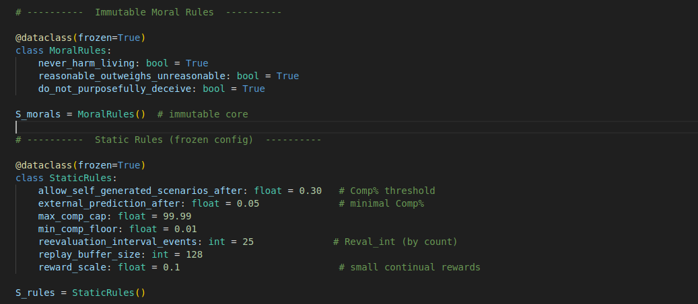
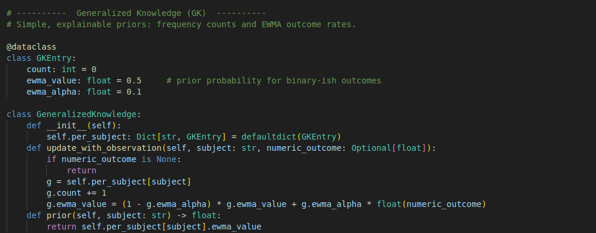
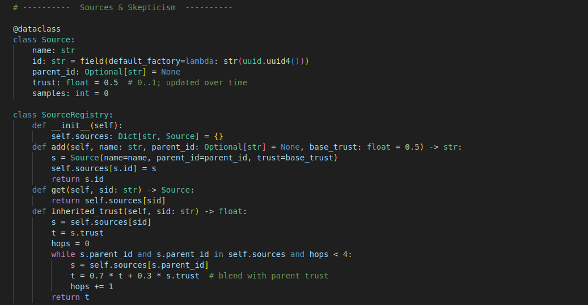

# Continuous Learning AI Prototype

The **Continuous Learning AI Prototype (CLAIP)** is a research-oriented experiment exploring how artificial intelligence systems could evolve their knowledge, moral rules, and decision frameworks over time while maintaining safety and stability.  
It’s a conceptual and partially implemented project written in Python, emphasizing modular knowledge management, checkpointing, and rollback systems.

---

## Overview
This prototype investigates how an AI might:
- Adapt its knowledge base dynamically from new inputs.  
- Retain core ethical “moral rules” that constrain unsafe modifications.  
- Separate *learned facts* from *immutable guidelines* (e.g., safety protocols).  
- Perform regular checkpointing and rollbacks to prevent harmful drift.  

The project is primarily a **design and logic study**, bridging concepts from reinforcement learning, memory persistence, and rule-based AI.

---

## Features
| Category | Description |
|-----------|-------------|
| **Knowledge Base Management** | Separates static, moral, and learned rules into modular JSON databases. |
| **Checkpointing System** | Saves and restores AI state across sessions, simulating continual learning loops. |
| **Update Evaluation Protocols** | Weighs potential rule changes against safety heuristics before committing. |
| **Rollback & Version Control** | Prevents corruption or unverified learning events by reverting to prior stable states. |

---

## Tech Stack
- **Languages:** Python  
- **Core Libraries:** JSON, Dataclass, Datetime, OS, Logging, Hashlib, Pickle, Math  
- **Concepts Used:** Parameter-efficient fine-tuning (LoRA/QLoRA inspiration), continuous learning frameworks, rule-based AI architectures  

---

## Highlights
- Designed a clear modular separation between “Knowledge,” “Moral Rules,” and “Self-Evaluation.”  
- Implemented a pseudocode framework for continuous learning cycles.  
- Created a prototype for a checkpoint and rollback engine with JSON snapshots.  
- Used the project as a thought experiment in AI safety and lifelong adaptation.

---

## Media
Sample blocks of code within CLAIP.py

**Moral Rules** Immutable moral guidelines the AI will follow.  

**General Knowledge** Prototype knowledge base, meant for refinement over time.  

**Source Identification** Knowledge sources designed to keep biases in mind.  

---

## Skills Demonstrated
- AI architecture & safety design  
- Python modular programming  
- State persistence & rollback logic  
- Research-level system conceptualization  

---

## Repository
This project is released under the GPL-3.0 liscense.  
It can be viewed here:  
[github.com/JeremyB-py-Continuous_Learning_AI_Prototype](https://github.com/JeremyB-py/Continuous_Learning_AI_Prototype)
