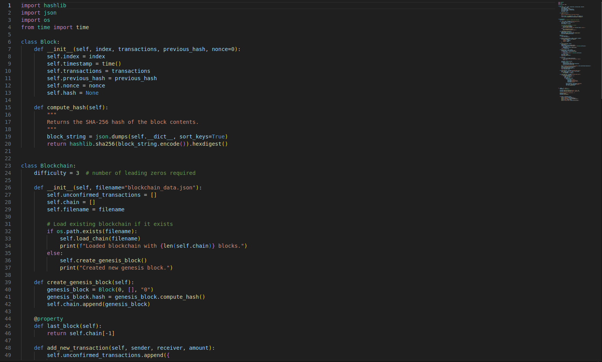
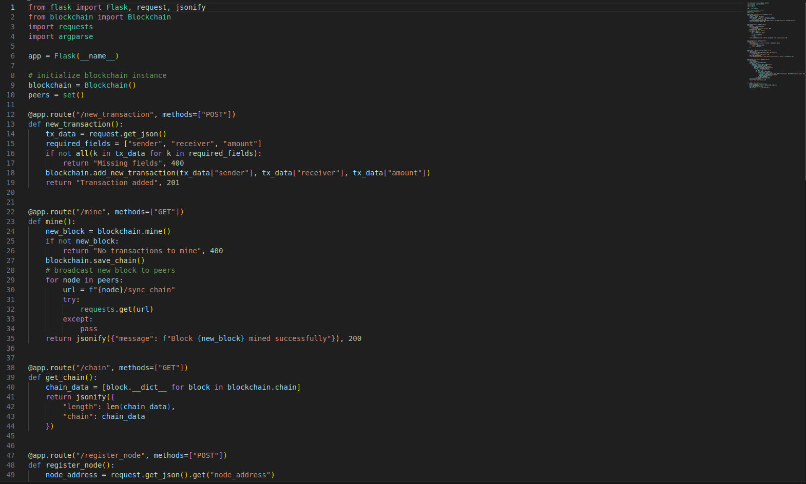

# Crypto Prototype (Toy Blockchain)

The **Crypto Prototype** is a lightweight Python implementation of a blockchain, built to learn decentralized consensus and transaction validation.  
It is a hands-on toy covering **blockchain architecture**, **proof-of-work mining**, and **node synchronization**.

---

## Overview
This project implements a functional toy blockchain that can:
- Create new blocks containing simulated transactions.  
- Validate blocks using a proof-of-work algorithm.  
- Link each block cryptographically via SHA-256 hashing.  
- Distribute updates across nodes via a simple networking layer.

The prototype stays small so the consensus and sync pieces are easy to follow.

---

## Features
| Category | Description |
|-----------|-------------|
| `Proof-of-Work Algorithm` | Adjustable difficulty for mining simulation. |
| `Transaction Queue` | Handles unconfirmed transactions before block creation. |
| `Block Validation` | Ensures hash linkage and integrity. |
| `Networking (Flask)` | Enables basic node communication and synchronization. |
| `JSON Storage` | Persists blockchain state across sessions. |

---

## Tech Stack
- **Languages:** Python  
- **Libraries:** Flask, Hashlib, JSON, Time, Requests  
- **Concepts:** Proof-of-work, block validation, node sync, REST API  

---

## Highlights
- Built full blockchain loop: transaction → block → proof-of-work → validation → chain update.  
- Debugged early transaction-pool and hash-computation issues to achieve stable mining.  
- Added optional Flask API endpoints for peer-to-peer simulation.

---

## Media
Early example code

**Blockchain Prototype code**  

**Node Server Prototype code**  

---

## Skills Demonstrated
- Blockchain fundamentals (proof-of-work, transaction pools, chain validation)  
- REST-style APIs with Flask; Requests for node-to-node calls  
- Cryptographic hashing (SHA-256) and Merkle-style linkage  
- JSON persistence for chain state  
- Python object-oriented design  
- Debugging and algorithm validation  

---

## Repository
This prototype is private.

Portfolio case study: [jeremyb.dev/projects/blockchain/](https://jeremyb.dev/projects/blockchain/)
