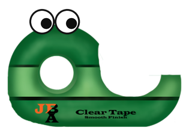
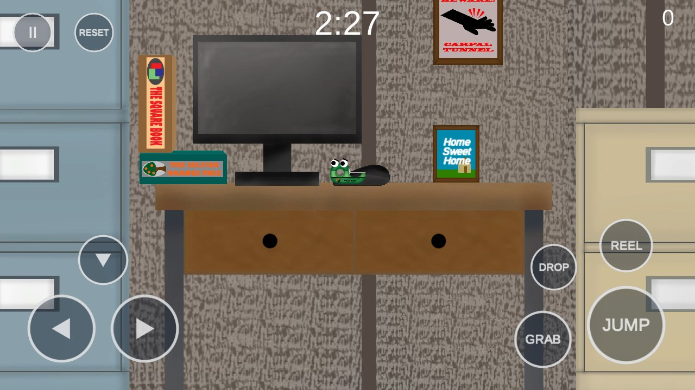
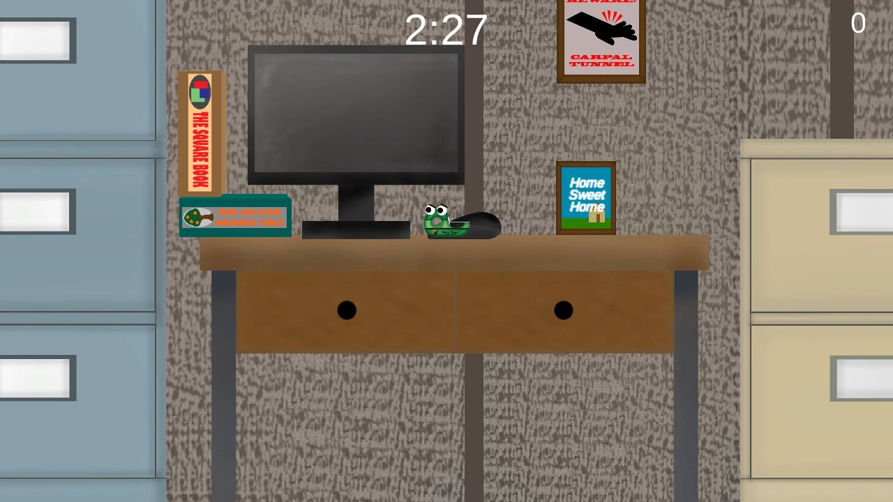

# Office Supply Stealth Game

**Office Supply Stealth Game** is a 2D platformer about revenge. You play a tape dispenser who was thrown away. To get back at your ex-owner, you spend each night moving his coworkers' office supplies to his desk to frame him. The goal is to get him fired in as few days as possible.

It started in 2018 as an indie game built in Unity and C#, and stopped at beta v0.7b. In 2026 it came to the browser in two versions: the **2018 original**, preserved with its bugs, and a **modernized** version updated with an AI coding agent (Claude Code) on a separate branch. Both are playable below.

  

    <button type="button" class="game-player__edition" aria-pressed="false" data-edition="archival" data-src="../games/ossg/archival/" data-poster="../media/ossg/archival.jpg" data-poster-alt="Level 1 in the 2018 build" data-caption="2018 original · v0.7b, keyboard only, original bugs kept" data-note="Loads about 15 MB. Keyboard only." data-touch-note="Opens the full-page player. Keyboard only: the 2018 build has no touch controls.">2018 original</button>
    <button type="button" class="game-player__edition" aria-pressed="true" data-edition="modernized" data-src="../games/ossg/modernized/" data-poster="../media/ossg/modernized.jpg" data-poster-alt="Level 1 in the modernized build, with the on-screen touch controls" data-caption="Modernized · Unity 6, gamepad and touch support" data-note="Loads about 16 MB. Keyboard, gamepad or touch." data-touch-note="Opens the full-page player with on-screen controls.">Modernized (2026)</button>
  

  

    

      

        
        

          <a class="game-player__play" href="../games/ossg/modernized/">Play</a>
          
Loads about 16 MB. Keyboard, gamepad or touch.

        

      

    

  

  

    
Modernized · Unity 6, gamepad and touch support

    

      <button type="button" class="game-player__fullscreen" hidden>Fullscreen</button>
      <a class="game-player__open" href="../games/ossg/modernized/">Full-page player ↗</a>
    

  

Full-page players: [Modernized](../games/ossg/modernized/) · [2018 original](../games/ossg/archival/)

---

## Overview

Office Supply Stealth Game was co-developed as an indie game in **Unity 2017.3** with **C#** from August to October 2018. It was one of my early programming projects, covering game state, events, debugging and version control. It stopped at beta **v0.7b** and was never finished commercially.

It was meant to be a 2D stealth platformer. It never got far enough to feel like a stealth game, but the name stuck. A short opening cutscene to set up the story was also planned and never made.

### How It Works

- **Nights:** each night runs on a timer. You start at your ex-owner's desk, grab whatever you can carry from around the office and bring it back. Anything left on his desk counts toward getting him fired.
- **Staplers:** they patrol the office. If one catches you, it knocks your items loose one at a time; if your hands are empty, it sends you back to the desk and costs you time.
- **Be back by morning:** if you are away from the desk when the timer runs out, that night's haul is halved.
- **Par:** once enough has piled up, he's fired. Par is five nights, and beating or matching it earns more skill points.
- **Skills:** spend skill points on carry capacity, movement speed, jump height, power-up duration, power-up boost and protection from time penalties. Points come from finishing a level, and new levels unlock as you beat the previous one (four in total).
- **Power-ups:** *pizza* lets you see items through walls, a *granola bar* adds time to the clock and *takeout* makes you invincible. There is no indicator yet for when they wear off.

The title screen explains the basics, and there is sound for most things, with volume settings in the options menu.

---

## Credits

- **Jeremy Brown:** programming and music
- **Brody Aubry:** artwork

---

## Media

  <figure>
    
    <figcaption>2018 original: the start of Level 1, keyboard only.</figcaption>
  </figure>
  <figure>
    
    <figcaption>Modernized: the same spot, with the on-screen touch controls.</figcaption>
  </figure>

---

## Archival (2018 original)

In 2026 the 2018 project was ported to **Unity 6000.4.6f1** so it could run in a browser. The gameplay is unchanged: only the engine APIs that Unity 6 removed were renamed.

It keeps its original bugs on purpose. The reset key does nothing, arrow-key players can't jump, and there are no touch controls. It is built from its own branch through a temporary worktree, so that branch never gets a commit or a changed file.

---

## Modernized (2026)

An AI-agent-assisted modernization with **Claude Code**, on a separate branch so the archival version stays untouched.

### Input

- Input moved to Unity's **Input System**, with **gamepad** support. Actions are bound in code, so there is no `.inputactions` asset to keep in sync.
- **Space** and **↑** now jump. Before, the game moved on the arrow keys but only jumped on W, so arrow-key players couldn't jump at all.

### Touch Controls

- On-screen **multi-touch controls** for phones, built in code with no scene or prefab edits.
- They only appear on touch-first devices (the CSS `pointer: coarse` query, or after the first real touch) and hide themselves during menus, pause and the end of a night. `?touch=1` and `?touch=0` force them on or off.

### Bug Fixes

Eleven 2018 bugs fixed. The most notable:

| Bug | Cause | Fix |
|-----|-------|-----|
| The reset key never worked | `ResetPosition()` is a coroutine, but it was called like a method and never started | Started properly; it costs the same time as falling, so it can't teleport you home with loot |
| No skill points for finishing on exactly night 12 | `CheckPar` used `< par + 7` and `> par + 7`, so the boundary matched neither | Moved to `GameRules.RewardForNights`, which covers every night count |
| The end-of-night count-up never ended if the score beat the target | The loop clamped its counter back below its own exit condition | Counts to `min(score, target)` |
| Power-ups stayed disabled after leaving a level mid-power-up | A static `isPowerActive` flag was never cleared | The owning power-up clears it in `OnDestroy` |

The other seven: a null reference in the enemies' line-of-sight check, pick-up and drop working while paused, pausing zeroing `fixedDeltaTime`, **Q** dropping only some items, a power-up spawn chance that was always 0 (`1 / 25` integer division), a duplicate `AudioManager` subscribing to events before destroying itself, and a field initializer that ran before `AudioManager.Awake`.

### Browser Behaviour

- **Saves persist:** `PlayerPrefs.Save()` runs after every progress write, because a browser tab never quits.
- **Pause on focus loss:** switching tabs mid-night opens the pause menu instead of leaving the timer running.
- **No dead Exit button:** `Application.Quit` does nothing in a tab, so the button is hidden.
- **A responsive web player page** that fills the screen from 4:3 to a phone held sideways. The release build went from a **78 MB** development build to about **15.9 MB**. It uses gzip with Unity's JavaScript decompression fallback and hashed file names, so it runs on static hosting like GitHub Pages with no special headers.

### Tests and Verification

- Scoring and skill rules pulled into a pure `GameRules` class with **22 unit tests** (Unity EditMode), including one proving the new stat formula matches the 2018 formula exactly.
- An automated **screenshot tour** loads every scene, plays part of Level 1 through the virtual input layer and checks that the reset key returns the player to spawn.
- A **headless-Chrome playtest script** runs a scripted playthrough of a web build: menus by mouse, Level 1 by keyboard, and an emulated phone using the on-screen buttons.

The browser test caught a real bug the desktop tests missed: after the input upgrade, **WebGL menus stopped registering mouse clicks**. The 2018 `StandaloneInputModule` still saw pointer movement but never clicks, so the fix swaps each scene's UI to the Input System's UI module at load time.

---

## Comparison

| | Archival (2018) | Modernized (2026) |
|---|---|---|
| Game code | v0.7b as left in October 2018 | v0.7b plus the changes above |
| Engine | Unity 2017.3, ported to Unity 6000.4.6f1 | Unity 6000.4.6f1 |
| Input | Keyboard (legacy Input Manager) | Keyboard, gamepad and touch (Input System) |
| Jump | W | W, Space or ↑ |
| Phones and tablets | No touch controls | On-screen multi-touch controls |
| 2018 bugs | Kept on purpose | Eleven fixed |
| Tab loses focus | Timer keeps running | Game pauses |
| Tests | None | 22 unit tests, screenshot tour, browser playtest |
| Download | About 15.1 MB | About 15.9 MB |

---

## Controls

| Action | Archival (keyboard) | Modernized (keyboard) | Modernized (gamepad) |
|---|---|---|---|
| Move | `A` `D` or `←` `→` | `A` `D` or `←` `→` | Left stick or D-pad |
| Jump | `W` | `W`, `Space` or `↑` | A |
| Drop through a shelf | `S` | `S` or `↓` | Down |
| Pick up | `E` | `E` | X |
| Drop carried items | `Q` | `Q` | Y |
| Reel items in (hold) | `R` | `R` | RT or RB |
| Reset to spawn | `` ` `` (does nothing, a 2018 bug) | `` ` `` (costs time) | View or Select |
| Pause | `Esc` | `Esc` or `P` | Menu or Start |

On phones and tablets, the modernized version shows on-screen buttons during a level. The 2018 original is keyboard only.

---

## Tech Stack

- **Engine:** Unity 2017.3 (2018), Unity 6000.4.6f1 (2026)
- **Language:** C#
- **Input:** Legacy Input Manager, then the Unity Input System and its UI module
- **Web:** WebGL 2, custom responsive player page (HTML, CSS, JavaScript)
- **Testing:** Unity Test Framework (EditMode), headless Chrome playtest script (Node.js), automated screenshot tour
- **Tooling:** Claude Code, Git branches and worktrees, shell build scripts

---

## Repository

The Unity source is private. The 2018 version and the modernization live on separate branches, and a draft pull request shows the full diff between them.

Portfolio case study: [jeremyb.dev/projects/ossg/](https://jeremyb.dev/projects/ossg/)

---

## Skills Demonstrated

- Game programming in C#: game state, events, scoring and progression (2018)
- Modernizing legacy code without touching the original: separate branches, archival builds from a throwaway worktree
- Root-causing old bugs: a coroutine that never started, an off-by-one boundary, static state leaking across scenes, integer division
- Extracting rules into a pure, testable class and proving it matches the old behaviour
- Input System migration, gamepad support and multi-touch controls built in code
- WebGL delivery: a 78 MB to 15.9 MB build cut, static hosting with no server config, browser lifecycle (focus, saves)
- End-to-end verification in a real browser, which caught a WebGL-only bug the desktop tests missed
- Directing an AI coding agent on a real codebase and reviewing its changes

---

## Next Steps

- Full gamepad navigation in menus (no menu sets a first-selected button yet)
- Velocity-based movement, which would fix falling through desks but changes how the game feels, so it needs playtesting first
- Re-saving the scenes out of Unity 2017 serialization once there is a reason to touch them
