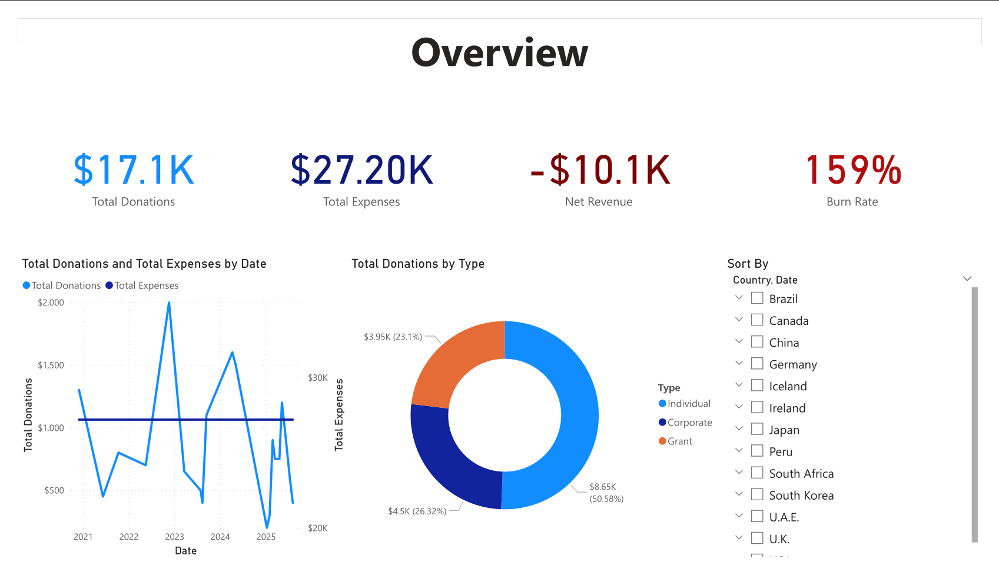
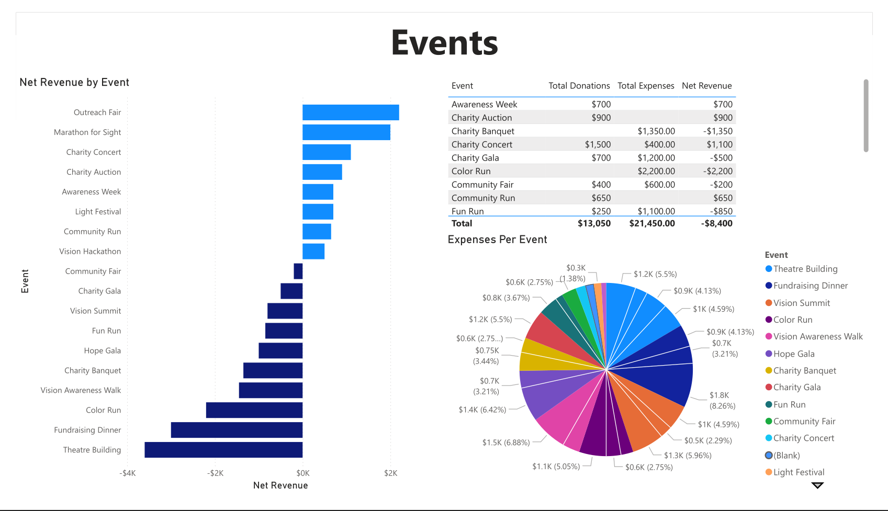
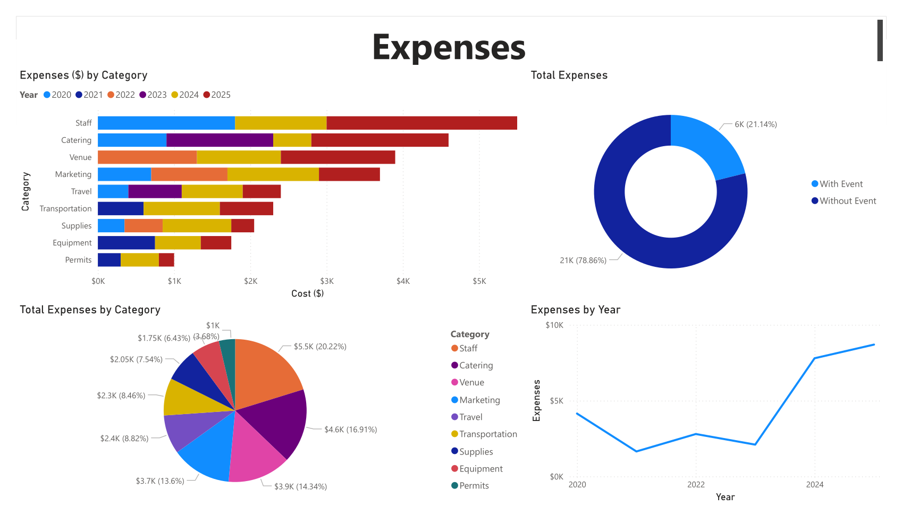
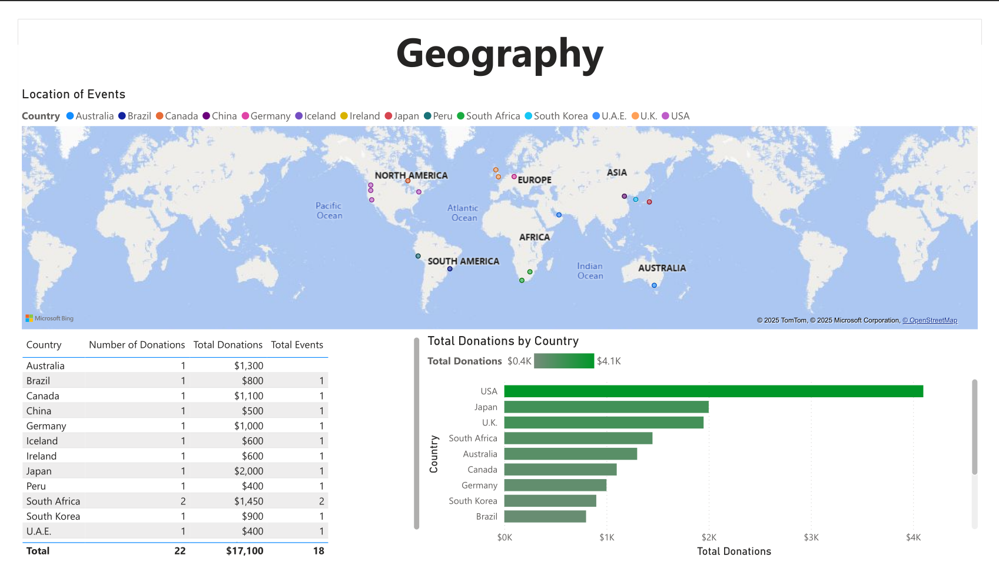

# Power BI Dashboard (Non-Profit Data Visualization)

A Power BI project created for a small non-profit organization to visualize their outreach and donation performance metrics.  
The goal was to design a **simple yet scalable dashboard** that could later connect to larger databases such as Azure SQL or SharePoint.

---

## Overview
This project demonstrates the ability to:
- Design a relational dataset for organizational tracking.  
- Build interactive Power BI dashboards for reporting and analysis.  
- Integrate data cleaning and transformation logic (Power Query).  
- Prepare models for easy migration to live database connections.  

The dashboard was first constructed using a small generated dataset, simulating donor, event, and outreach metrics.

---

## Features
| Category | Description |
|-----------|-------------|
| `Donor Analytics` | Tracks donation trends, averages, and repeat donor rates. |
| `Event Reporting` | Displays engagement per event and total attendance. |
| `Volunteer Metrics` | Shows participation over time, categorized by region or activity. |
| `Regional Analytics` | Displays location data for events and donors. |
| `Scalability` | Dataset and Power BI model structured to connect to Azure or SQL Server. |

---

## Tech Stack
- **Tools:** Power BI, Power Query, DAX  
- **Data Source:** Simulated CSV dataset (expandable to Azure SQL)  
- **Concepts:** ETL design, KPI visualization, dashboard modeling  

---

## Highlights
- Created full data pipeline: simulated dataset → Power Query ETL → DAX measures → dashboard.  
- Implemented drill-through interactions and slicers for user-friendly exploration.  
- Designed visuals for clarity and scalability (KPIs, trends, and card summaries).  
- Structured schema to easily swap simulated data for live Azure or API connections.  

---

## Media
Example pages of the dashboard using generated datasets. All pages are connected and interactable.

**Dashboard Overview**  

**Events Page**  

**Expenses Page**  

**Geography Page**  

---

## Skills Demonstrated
- Data modeling & visualization  
- ETL design (Power Query)  
- DAX expressions & KPIs  
- Business reporting & storytelling  
- Azure/SQL-ready data design  

---

## Repository
A simple example of this Power BI project is located here:  
[github.com/JeremyB-py-Non-Profit_Funds](https://github.com/JeremyB-py/Non-Profit_Funds)
