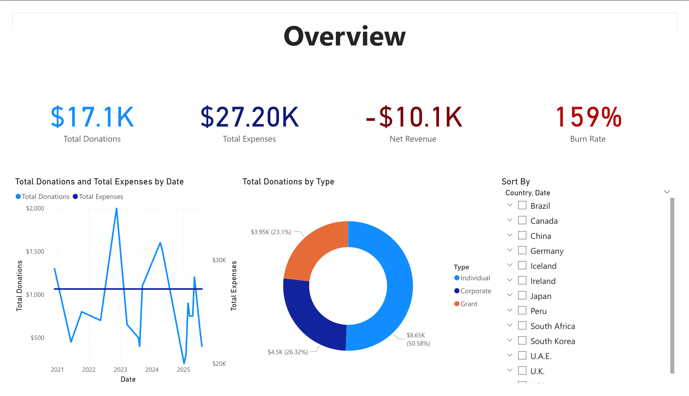
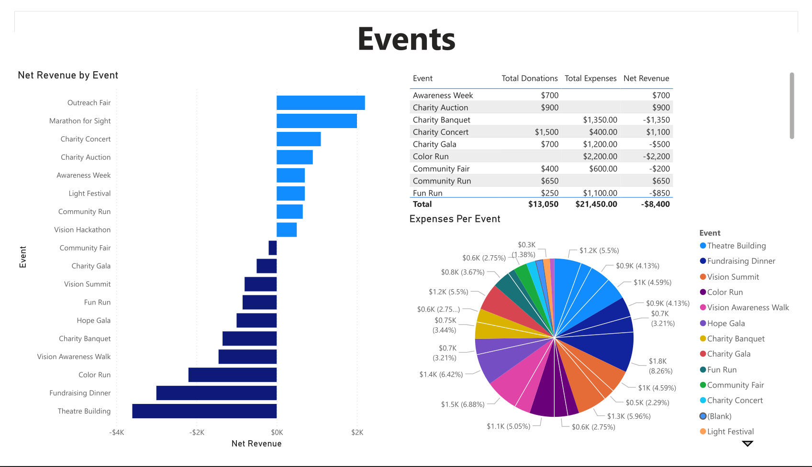
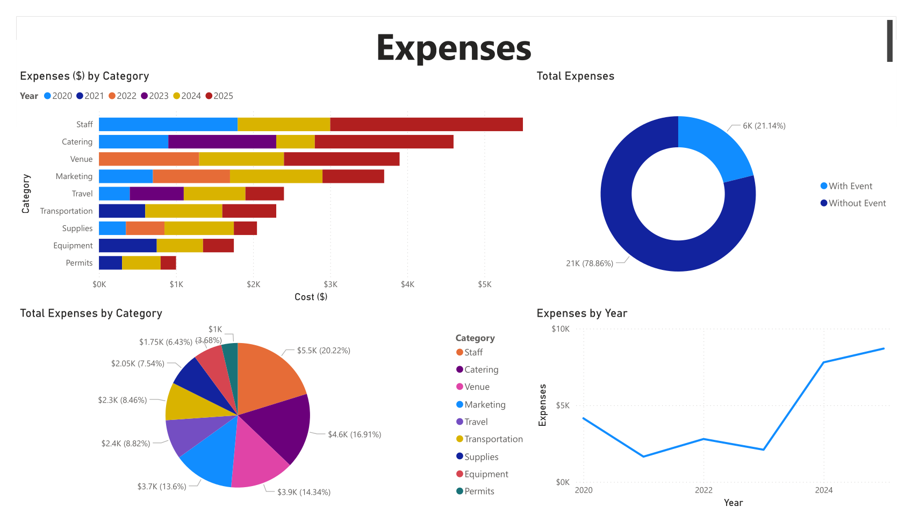
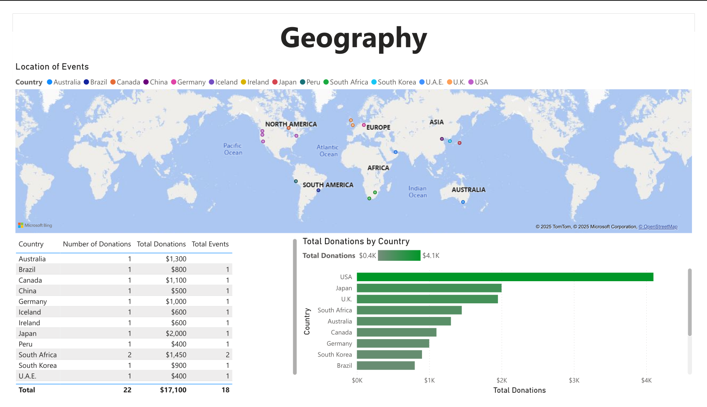

# Power BI Dashboard (Non-Profit Data Visualization)

A Power BI project created for a small non-profit organization to visualize their outreach and donation performance metrics.  
The dashboard was built so it could later connect to Azure SQL or SharePoint.

---

## Overview
This project includes:
- A relational dataset for organizational tracking.  
- Interactive Power BI dashboards for reporting and analysis.  
- Data cleaning and transformation in Power Query.  
- A model laid out so it can move to a live database connection.  

The dashboard was first constructed using a small generated dataset, simulating donor, event, and outreach metrics.

---

## Features
| Category | Description |
|-----------|-------------|
| `Donor Analytics` | Tracks donation trends, averages, and repeat donor rates. |
| `Event Reporting` | Displays engagement per event and total attendance. |
| `Volunteer Metrics` | Shows participation over time, categorized by region or activity. |
| `Regional Analytics` | Displays location data for events and donors. |
| `Scalability` | Dataset and Power BI model structured to connect to Azure or SQL Server. |

---

## Tech Stack
- **Tools:** Power BI, Power Query, DAX  
- **Data Source:** Simulated CSV dataset (expandable to Azure SQL)  
- **Concepts:** ETL design, KPI visualization, dashboard modeling  

---

## Highlights
- Created full data pipeline: simulated dataset → Power Query ETL → DAX measures → dashboard.  
- Implemented drill-through interactions and slicers.  
- Designed visuals for KPIs, trends, and card summaries.  
- Structured schema to easily swap simulated data for live Azure or API connections.  

---

## Media
Example pages of the dashboard using generated datasets. All pages are connected and interactable.

**Dashboard Overview**  

**Events Page**  

**Expenses Page**  

**Geography Page**  

---

## Skills Demonstrated
- Data modeling & visualization (star/snowflake-friendly layouts)  
- ETL design (Power Query) for simulated and future live sources  
- DAX expressions, KPIs, and measure design  
- Interactive reporting (slicers, drill-through, cross-filtering)  
- Azure/SQL-ready schema and CSV-based prototyping  

---

## Repository
A simple example of this Power BI project is located here:  
[github.com/JeremyB-py/Non-Profit_Funds](https://github.com/JeremyB-py/Non-Profit_Funds)
