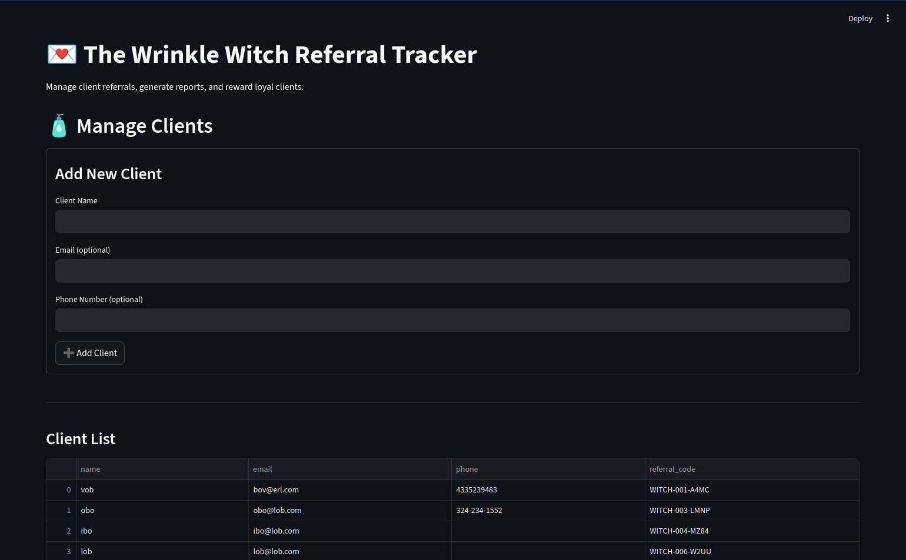
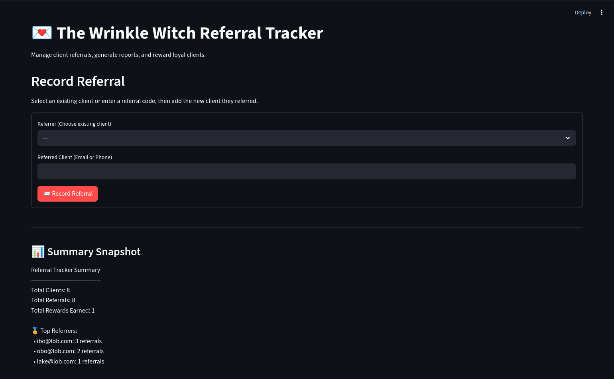
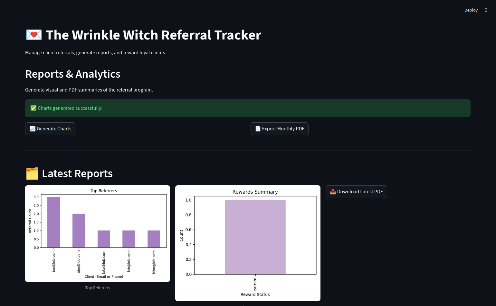
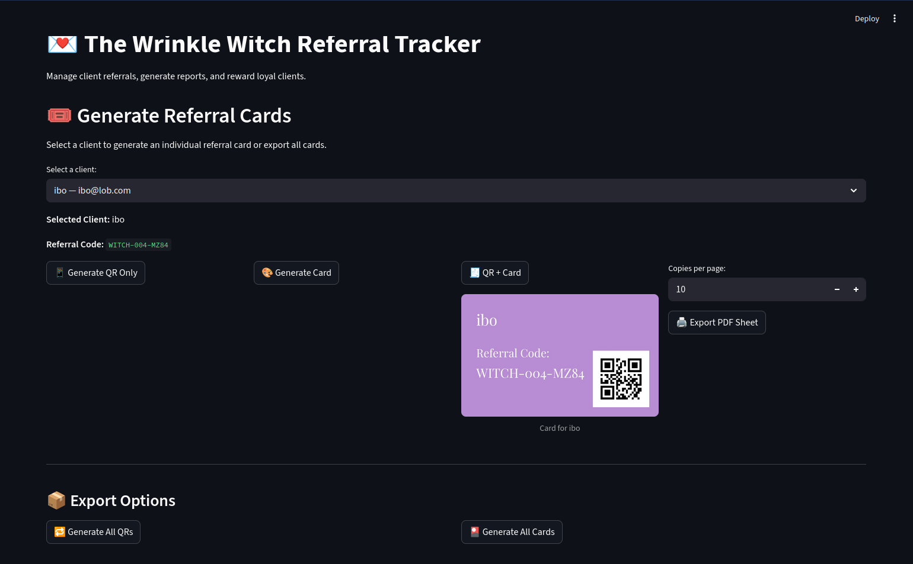

# Referral Tracker Module

The **Referral Tracker** is a Streamlit app for **The Wrinkle Witch**, a local skincare business. It handles client referral tracking and branded referral cards.

It started as a standalone Streamlit script and is now an internal admin app on the [Wrinkle Witch Website & Full-Stack Business Platform](./wrinkle_witch_website.md). This write-up covers referral logic, card/PDF generation, and Streamlit session-state control.

---

## Overview

The Referral Tracker extends the CRM client data with a tool for **referrals, incentives, and branded referral cards**.  
It automates a previously manual workflow so the business can:
- Track who referred whom (and when).  
- Automatically associate clients through linked referral logic.  
- Generate customized referral cards with the salon's branding, contact details, and referrer name.  
- Export single or multi-client PDFs for in-person distribution.  

Streamlit reruns were wiping unsaved data in earlier prototypes. Session flags keep context across reruns.

---

## Features

| Category | Description |
|-----------|-------------|
| **Client Referral Linking** | Automatically links clients as referrer/referee pairs based on user input or CSV lookup. |
| **Session State Control** | Custom session management prevents Streamlit reruns from erasing unsaved data. |
| **Dynamic Card Generator** | Uses Pillow to generate custom-branded PNG referral cards with business colors, logo, and typography. |
| **PDF Batch Export** | Combines generated cards into printable PDFs for each client or the entire business. |
| **Error Handling & Validation** | Input validation for CSV syncing and duplicate detection. |
| **Persistent Storage** | All updates are written back to disk immediately through CSV synchronization and optional SQLite integration. |

---

## Tech Stack

- **Framework:** Streamlit  
- **Languages:** Python  
- **Libraries:** Pandas, Pillow, FPDF, OS, Time, Reportlab  
- **Storage:** CSV (primary), SQLite (optional for scaling)  
- **Platform:** Local deployment for business use  

---

## Architecture & Modular Design

The Referral Tracker is designed as a **self-contained module** within the Wrinkle Witch CRM framework.  

### Core Modules

| Module | Purpose |
|---------|----------|
| `analytics_manager.py` | Creates summary reports and charts for referrals. |
| `client_manager.py` | Handles loading, validation, and updating of client data. |
| `referral_card_generator.py` | Creates individual PNG cards from client info and branding assets. |
| `referral_manager.py` | Tracks client referrals, allowing for rewards for both referrer and referred. |
| `streamlit_app.py` | Streamlit front-end with integrated feedback, progress, and rerun control. |

This structure allows it to be:
- Run as a **standalone Streamlit app** (`streamlit run streamlit_app.py`), or  
- Imported as a **module** into the larger CRM platform for integrated usage.

---

## Highlights

- **New Modular Codebase:** Refactored older CRM logic into reusable components with clean import structures.  
- **Stable UI Behavior:** Solved persistent Streamlit rerun issues via controlled session flags.  
- **Optimized PDF Export:** Batched multiple PNGs per page with precise sizing for card stock printing.  
- **Customizable Branding:** Easily configurable assets (logo, fonts, card dimensions, and color palette).  
- **Real Business Deployment:** Currently used internally by *The Wrinkle Witch* for client engagement.  

---

## Media

**Landing Page** with client adding and editing  

**Referral Page** for tracking client referrals and rewards  

**Reports Page** Summaries and graphs for client data  

**Referral Card Page** Creating referral cards for individual clients to hand out, with qr codes and template functionality  

---

## Skills Demonstrated

- Streamlit app development  
- Modular Python architecture  
- Data persistence & CSV/SQLite synchronization  
- Image manipulation (Pillow) for branded referral cards  
- PDF generation and layout (FPDF, ReportLab) for batch exports  
- Analytics-style reporting (charts/summaries via module layer)  
- QR codes and printable card templates for in-person marketing  
- Business process automation  
- Debugging and UI state control in Streamlit  

---

## Integration with Wrinkle Witch CRM

The Referral Tracker is the first deployed module in the Wrinkle Witch CRM ecosystem.  
It connects directly to the CRM's client database and shares common components such as `client_manager.py` and CSV sync utilities.

**Related project:**  
The **Wrinkle Witch CRM** core project is maintained as a separate private repository due to business sensitivity.  
CRM write-up: [Wrinkle Witch CRM](./wrinkle_witch_crm.md)

---

## Future Improvements
 
- Add direct integration with the Square API for automatic referral code generation.  
- Introduce analytics dashboard summarizing referral performance.  
- Implement optional secure login for multi-user business usage.

---

## Repository

This module is maintained as a separate private repository due to business sensitivity.

Portfolio case study: [jeremyb.dev/projects/referral-tracker/](https://jeremyb.dev/projects/referral-tracker/)

