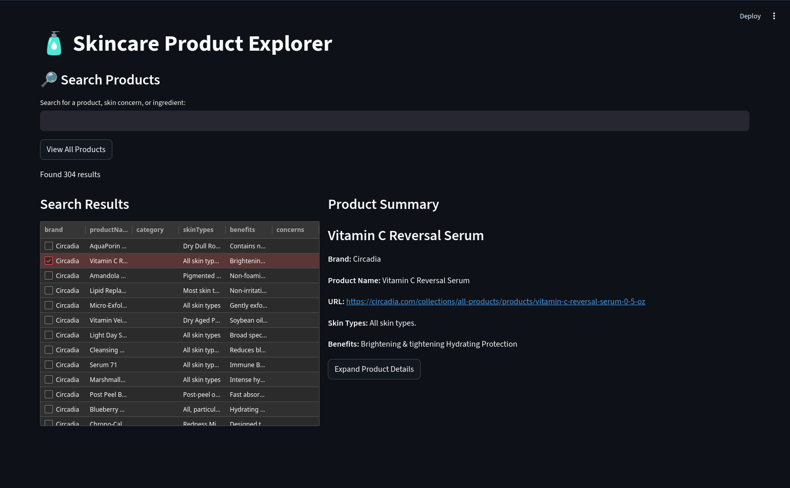
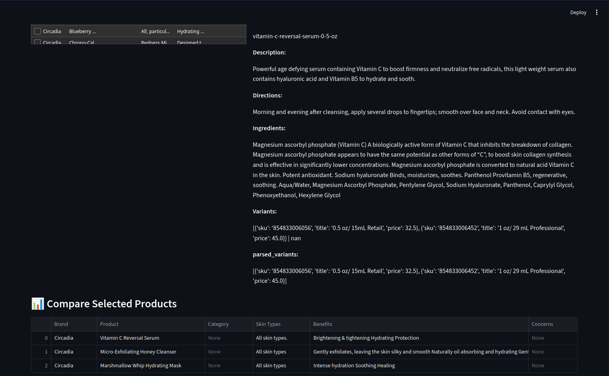
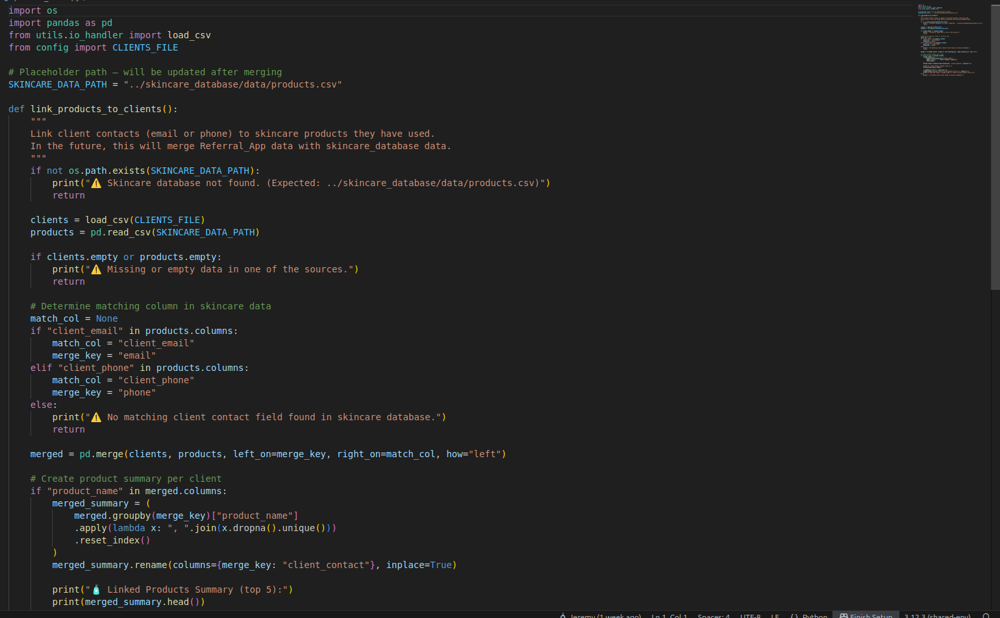

# Wrinkle Witch CRM (Core Platform)

The **Wrinkle Witch CRM** is a Streamlit product database and internal admin app for **The Wrinkle Witch**, a local skincare business. It started as a **searchable catalog of esthetician products** (CSV and SQLite) and is now an internal app on the [Wrinkle Witch Website & Full-Stack Business Platform](./wrinkle_witch_website.md). The Referral Tracker uses the same client data layer.

This write-up covers the CRM module itself: product database, data layer, and how other Streamlit apps plug in.

---

## Overview

The CRM is a structured product lookup and management system for brands such as Circadia, GlyMed, and PCA. Product pages, search, and local persistence are in use. Referral tracking ships as a separate [Referral Tracker](./referral_tracker.md) app on the same platform.

Planned, not shipped:

- **Client Tracking & Scheduling Integration:** Connect client profiles and appointments with Square API data.
- **Routine Suggestions:** Recommendation engine for skincare routines based on client skin types and purchased products.
- **Automatic Reminders & Follow-ups:** Client check-ins or reorder prompts.

New Streamlit tools can share the same database layer, UI structure, and branding assets.

---

## Features

| Category | Description |
|-----------|-------------|
| `Product Retrieval` | Fetch information and images for all products from an expandable number of skincare websites using BeautifulSoup and Playwright. |
| `Product Search` | Search, filter, and browse esthetician products across brands (e.g., Circadia, GlyMed, PCA). |
| `Data Persistence` | Stores all product and configuration data in CSV and SQLite for easy backup and portability. |
| `Extensible Framework` | Structured around modular imports, making it easy to integrate new Streamlit-based features. |
| `Referrals & Rewards` | Referral Tracker module for client referral workflows and PDF exports. See [Referral Tracker](./referral_tracker.md). |
| `Scheduling hooks` | Planned Square API integration for scheduling, reminders, and analytics. |

---

## Tech Stack

- **Frontend/UI:** Streamlit  
- **Backend/Data:** Python, Pandas, SQLite, CSV I/O  
- **Modules:** OS utilities, Session State Management, Playwright, BeautifulSoup  
- **Version Control:** Git / VS Code  

---

## Modular Extensions

| Module | Description |
|---------|--------------|
| **Referral Tracker** | Referral tracking, PDF card generation, and CSV synchronization. [Write-up](./referral_tracker.md). |
| **Product Database** | Core CRM feature enabling advanced product search, brand lookup, and data management for estheticians. |
| **Client Analytics Dashboard** | Planned Streamlit dashboard for tracking client activity, preferences, and product usage patterns. |
| **Routine Suggestions (Planned)** | Smart recommendation engine to suggest skincare routines based on client and product data. |

---

## Highlights

- Searchable product database in production use by *The Wrinkle Witch*.  
- Persistent local-first data layer (CSV and SQLite).  
- Referral Tracker ships as a separate internal app on the same platform.

---

## Media

**Product Search Interface:** Searchable database of all products through tags.  

**Expandable and Comparable Product Details** Each product can be examined in further detail.  

**Module Architecture Diagram:** Prototype code in place for modules to plug into the core system.  

---

## Future Improvements

- Database will be searchable through recommendations and more advanced tags.
- Tracking client usage and success with specific products or brands.
- Implementation of future modules.

---

## Skills Demonstrated

- Streamlit app architecture & modularization  
- Python development and data management  
- Pandas for tabular data shaping and exports  
- SQLite & CSV data pipelines (local-first persistence, backup-friendly workflows)  
- Web scraping & HTML parsing (BeautifulSoup, Playwright) for product retrieval  
- Session-state handling in reactive UIs  
- Business process automation & scalability planning  
- Modular system design for future integrations (e.g. Referral Tracker, Square hooks)  

---

## Repository

This project is private due to business use.

Portfolio case study: [jeremyb.dev/projects/wrinkle-crm/](https://jeremyb.dev/projects/wrinkle-crm/)
