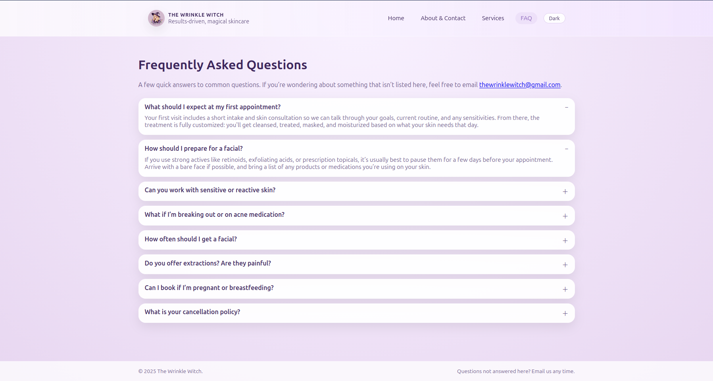
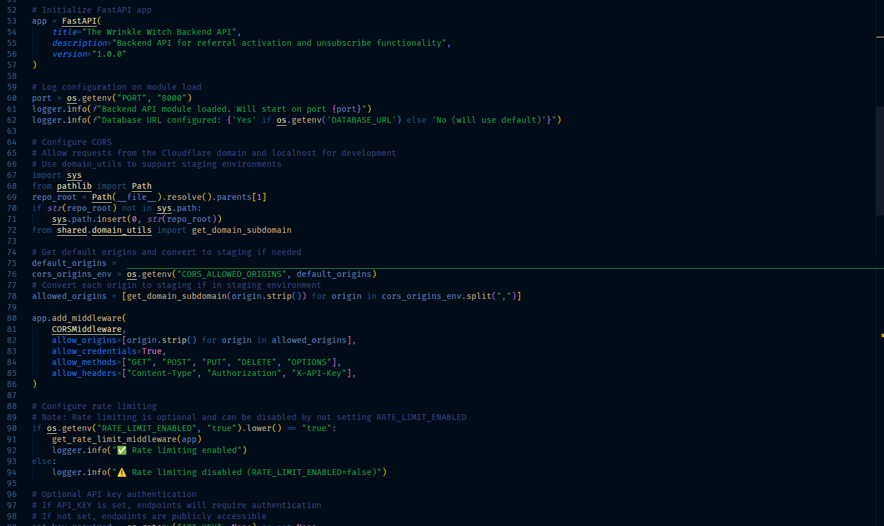
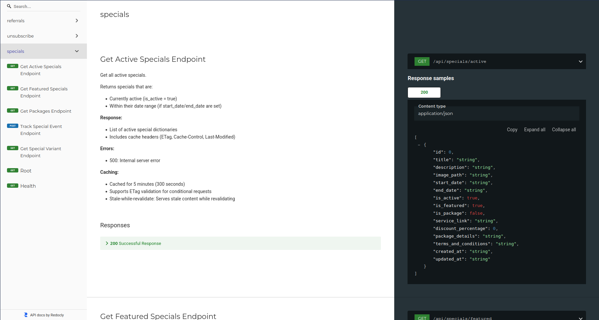
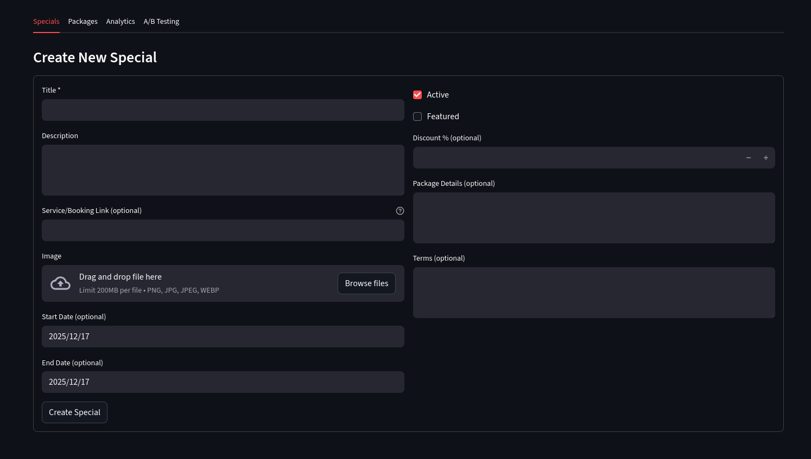
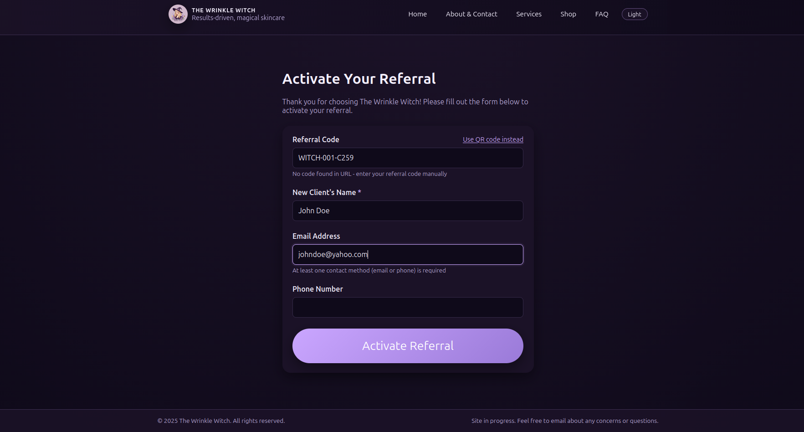
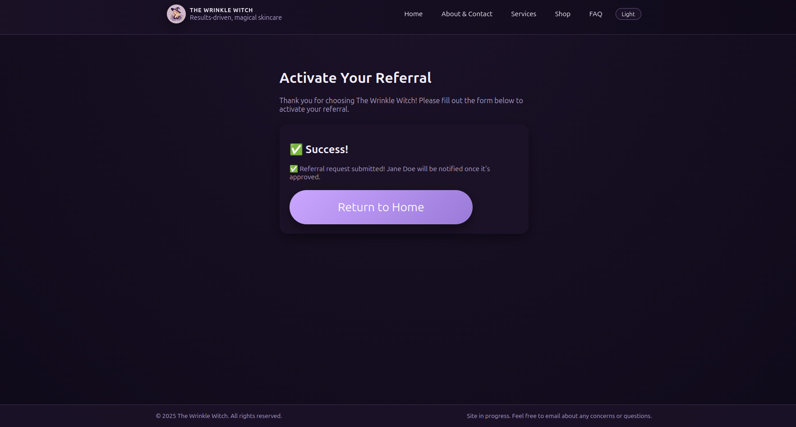

# Wrinkle Witch Website & Full-Stack Business Platform

A modular, multi-application platform built for **The Wrinkle Witch**, a local esthetician business. The project combines a static customer website with a backend API service and internal admin apps, all sharing a single set of core business logic and database models inside a monorepo.

This platform is designed to scale: new tools (CRM features, product systems, booking workflows, analytics, etc.) can be added without duplicating authentication, database code, or integrations.

---

## Overview

At a high level, the platform is split into three layers:

**Customer-facing website (Static HTML)**  
Hosted as static pages for speed and simplicity (ideal for branding/SEO). Public pages call backend APIs when needed (referrals, unsubscribe, specials).

**Backend API service (FastAPI)**  
A dedicated API layer that performs validation, business logic execution, and database writes. Deployed independently (Railway) and reachable via a stable subdomain.

**Internal admin apps (Streamlit)**  
Admin-facing tools for managing clients, referrals, specials/packages, and internal workflows. Protected behind database-backed authentication with roles.

All layers share reusable modules inside `/shared` (auth, Square OAuth helpers, domain/environment utilities, business_id handling, etc.).

---

## Architecture Highlights

### Monorepo Structure

- `homepage/` → Static site (Cloudflare Pages)
- `backend/` → FastAPI service (Railway)
- `referral_app/` → Streamlit internal admin + referral tooling
- `skincare_db/` → Streamlit product database tooling
- `shared/` → Shared Python modules used across apps

### "Static UI + API Backend" Migration

A key evolution in this project was migrating client-facing flows away from Streamlit pages to static branded pages, while keeping the "real logic" in the backend:

- **Referral activation:** Static HTML form → POST `/api/referrals/activate` → database
- **Unsubscribe:** Static confirmation page → POST `/api/unsubscribe` → database update
- **QR codes** updated to point to stable, branded URLs on the main domain (instead of Streamlit routes)

This keeps customer experiences fast and consistent while still supporting robust server-side validation and logging.

---

## Key Features

| Category | Description |
|-----------|-------------|
| `Customer-Facing Website` | Static, fast-loading pages with a consistent brand design system. Responsive layout + theme toggle (light/dark). Dedicated referral landing page with URL parsing for referral codes (`/ref/CODE` or `?code=CODE`), client-side validation + friendly status messaging, and manual referral code entry fallback if a QR code is lost. Unsubscribe confirmation page with token/type parsing and safe confirmation UX. |
| `Backend API Service (FastAPI)` | Production API deployed via Railway and routed on `api.thewrinklewitch.com`. Endpoints include referral activation + referrer-info lookup, unsubscribe handling (token-based), specials/featured specials/packages endpoints for homepage slideshows, and analytics tracking endpoints for specials engagement events. Strong API hygiene: Pydantic validation (email/phone formats, required fields), clear HTTP status codes and error messages, CORS configuration via environment variables, and rate limiting support (configured at the middleware level). |
| `Shared Modules and Reusable Integrations` | Shared Square OAuth refactor: OAuth moved into `shared/square_auth.py`, token storage standardized with a token adapter protocol so each app can provide its own DB model/storage. Shared SquareManager focuses on Square API calls, while OAuth/token lifecycle lives in the shared auth module. Shared business_id handling: `get_business_id()` moved into `shared/business_id.py` to work in Streamlit, FastAPI, and CLI contexts. Domain/environment utilities: Shared helpers for staging vs production URL construction and routing-ready subdomain strategy. |
| `Security & Admin Tooling` | Database-backed authentication + roles: Upgraded from simple password checks to bcrypt password hashing, role-based access control (admin/user), and session persistence within Streamlit. Added an admin-only User Management page: create users, change passwords, delete users (with safety checks), optional login attempt rate limiting + failed login logging. OAuth flow safety: OAuth callback routes are configured to avoid auth interruptions during the Square connection handshake (prevents broken OAuth sessions). |
| `Specials / Packages System (Marketing Engine)` | A major feature addition is a full Specials/Deals management system that powers dynamic homepage content. Admin can create/edit specials (title, description, dates, featured/active flags) with optional images with automatic optimization (resize/compress for web). Frontend: `services.html` shows an auto-rotating specials slideshow, `index.html` shows featured specials (with fallback behavior if none exist), and clickable images can route to booking/service links. Analytics tracking: View/click tracking events stored in the database, admin analytics dashboard with totals + CTR-style metrics + exports. A/B testing groundwork: Variant fields + traffic split logic exist in the backend layer, admin UI supports creating tests and comparing performance (frontend variant selection can be wired in as a next enhancement). |
| `Performance & Caching` | To keep the static site fast while still supporting dynamic content: Backend GET endpoints support caching headers (ETag + conditional requests / 304), frontend uses cache-aware fetching with fallback behavior (sessionStorage) for resilience, and static asset caching rules are documented and configurable for CDN/server environments. |
| `Testing & CI` | Component-level tests across the monorepo (shared modules, referral app logic, homepage HTML validation). CI improvements to support pull request workflows reliably (permissions + git-based path filtering). Fixed real-world reliability issues including SQLAlchemy "reserved attribute name" deployment crash, pytest DB initialization/import-order failures, and missing table registration edge cases in CI environments. |

---

## Tech Stack

- **Frontend (Public):** HTML · CSS · JavaScript (static site)
- **Admin UI:** Streamlit + custom styling
- **Backend:** FastAPI + Uvicorn
- **Data Layer:** SQLAlchemy ORM · PostgreSQL (prod) / SQLite (dev/testing)
- **Integrations:** Square OAuth + API patterns (shared modules + adapter design)
- **Deployment:** Cloudflare Pages (static site) · Railway (API service)
- **Tooling:** pytest · GitHub Actions CI · structured monorepo architecture

---

## Media

**Public Website Homepage:** Clean, modern design showcasing the business brand and services.  

**Dark Mode Interface:** Alternative color scheme for improved user experience.  

**FAQ Page:** Customer-facing frequently asked questions section.  

**FastAPI API Setup (CORS Middleware):** Core API configuration showing FastAPI initialization and `CORSMiddleware` setup for the production-facing service.  

**FastAPI Docs (Specials Endpoints):** ReDoc view highlighting the Specials/Packages API surface used by the static site for dynamic homepage content.  

**Admin Specials Manager:** Streamlit admin UI for creating and managing specials/packages content (marketing engine).  

**Admin User Management:** Admin-only UI for user management, supporting role-based access and bcrypt-backed authentication.  

**Manual Referral Entry:** Customer-facing referral flow with manual code entry fallback when a QR code is unavailable.  

**Referral Success State:** Confirmation/status messaging after a referral code is successfully processed.  

---

## Highlights

- Built a unified platform combining website, CRM, referrals, and admin tools.
- Supports future modules like client analytics, loyalty systems, and product recommendations.
- Clean, maintainable architecture suitable for long-term scaling.
- Real-world use case with evolving business needs.
- Blends full-stack development with automation and data workflows.

---

## Repository

The codebase is private due to business content, but this page represents a comprehensive summary.
A summarized showcase of the platform is available in the portfolio README:  
[github.com/JeremyB-py-Portfolio](https://github.com/JeremyB-py-Portfolio)

---

## Skills Demonstrated

- Full-stack system design (static frontend + API backend + admin apps)
- Modular monorepo architecture with shared utilities
- FastAPI endpoint design (validation, errors, CORS, deployment)
- SQLAlchemy modeling + practical production/CI debugging
- Secure auth patterns (bcrypt hashing, roles, admin tooling)
- API integration patterns (Square OAuth refactor + adapter interfaces)
- Performance optimization (HTTP caching strategy + resilient frontend fetching)
- Marketing/analytics engineering (specials engine, tracking, A/B testing groundwork)

---

## Next Steps

- Wire A/B test variant selection into the homepage slideshow fetch logic
- Expand Square integration (appointments sync, customer enrichment)
- Add deeper client analytics dashboards (retention, referral funnels, specials performance over time)
- Build the "Endorsed Products" system to power the Shop page dynamically
- Continue hardening multi-tenant patterns (business_id from auth context/subdomain)

---
