# Wrinkle Witch Website & Full-Stack Business Platform

A modular, multi-application platform built for **The Wrinkle Witch**, a local esthetician business. The project combines a static customer website with a backend API service and internal admin apps, all sharing a single set of core business logic and database models inside a monorepo.

This platform is designed to scale: new tools (CRM features, product systems, booking workflows, analytics, etc.) can be added without duplicating authentication, database code, or integrations.

---

## Overview

At a high level, the platform has four main parts:

**Customer-facing website (Static HTML)**  
Hosted as static pages for speed and simplicity (ideal for branding/SEO). Public pages call backend APIs when needed (referrals, unsubscribe, specials).

**Backend API service (FastAPI)**  
A dedicated API layer that performs validation, business logic execution, and database writes. Deployed independently (Railway) and reachable via a stable subdomain.

**Internal admin apps (Streamlit)**  
Admin-facing tools for managing clients, referrals, specials/packages, and internal workflows. Protected behind database-backed authentication with roles.

**Scheduled jobs (`/jobs`)**  
Background tasks (credit expiration, quarterly reset/prizes, appointment sync) run via Railway cron; job status is visible and manually triggerable from the referral app.

All layers share reusable modules inside `/shared` (auth, Square OAuth helpers, domain/environment utilities, business_id handling, etc.).

---

## Architecture Highlights

### Monorepo Structure

- `homepage/` → Static site (Cloudflare Pages)
- `backend/` → FastAPI service (Railway)
- `referral_app/` → Streamlit internal admin + referral tooling
- `skincare_db/` → Streamlit product database tooling
- `jobs/` → Scheduled background jobs (Railway cron)
- `shared/` → Shared Python modules used across apps

### "Static UI + API Backend" Migration

A key evolution in this project was migrating client-facing flows away from Streamlit pages to static branded pages, while keeping the "real logic" in the backend:

- **Referral activation:** Static HTML form → POST `/api/referrals/activate` → database
- **Unsubscribe:** Static confirmation page → POST `/api/unsubscribe` → database update
- **Online booking:** Custom multi-step flow on `booking.html` (service, date/time, your info, secure card step, review) calling Square Bookings API and optional Square Web Payments SDK for card-on-file
- **QR codes** updated to point to stable, branded URLs on the main domain (instead of Streamlit routes)

This keeps customer experiences fast and consistent while still supporting robust server-side validation and logging.

---

## Key Features

| Category | Description |
|-----------|-------------|
| `Customer-Facing Website` | Static, fast-loading pages with a consistent brand design system; responsive layout + theme toggle (light/dark). Referral: dedicated landing page with URL parsing (`/ref/CODE` or `?code=CODE`), manual code entry fallback, and referral-program/leaderboard/terms pages. Unsubscribe confirmation with token/type parsing. Online booking on `booking.html` (multi-step flow, Square integration). Specials/packages slideshows; maintenance banners during scheduled job runs. |
| `Backend API Service (FastAPI)` | Production API deployed via Railway on `api.thewrinklewitch.com`. Endpoints: referral activation + referrer-info, unsubscribe (token-based), specials/featured/packages + analytics tracking; full booking API (create, list, get, update, cancel, availability, services, team-members, locations, payment-config). Strong API hygiene: Pydantic validation, clear status codes/errors, CORS via env, rate limiting. |
| `Square Bookings & Payments` | Multi-step booking flow: service selection (from Square Catalog when configured), date/time, your information (required allergies/special-requests, phone validation), secure card step (Square Web Payments SDK, tokenize, optional save-on-file), review and confirmation. Cancellation policy and payment-config endpoint for SDK init. Booking tokens for referral credits and pre-fill; single-use enforcement. |
| `Scheduled Jobs` | Credit expiration (daily), quarterly reset, quarterly prizes, and Square appointment sync run via Railway cron; single scheduler entry point checks due jobs. Job execution logged in DB; referral app has Job Status tab for history, health, and manual trigger. Maintenance status API for frontend banners during job runs. |
| `Shared Modules and Reusable Integrations` | Shared Square OAuth refactor: OAuth moved into `shared/square_auth.py`, token storage standardized with a token adapter protocol so each app can provide its own DB model/storage. Shared SquareManager focuses on Square API calls, while OAuth/token lifecycle lives in the shared auth module. Shared business_id handling: `get_business_id()` moved into `shared/business_id.py` to work in Streamlit, FastAPI, and CLI contexts. Domain/environment utilities: Shared helpers for staging vs production URL construction and routing-ready subdomain strategy. |
| `Security & Admin Tooling` | Database-backed authentication + roles: Upgraded from simple password checks to bcrypt password hashing, role-based access control (admin/user), and session persistence within Streamlit. Added an admin-only User Management page: create users, change passwords, delete users (with safety checks), optional login attempt rate limiting + failed login logging. OAuth flow safety: OAuth callback routes are configured to avoid auth interruptions during the Square connection handshake (prevents broken OAuth sessions). |
| `Specials / Packages System (Marketing Engine)` | A major feature addition is a full Specials/Deals management system that powers dynamic homepage content. Admin can create/edit specials (title, description, dates, featured/active flags) with optional images with automatic optimization (resize/compress for web). Frontend: `booking.html` and `index.html` show specials slideshows and featured specials (with fallback when none exist); clickable images route to booking/service links. Analytics tracking: View/click tracking events stored in the database, admin analytics dashboard with totals + CTR-style metrics + exports. A/B testing groundwork: Variant fields + traffic split logic exist in the backend layer, admin UI supports creating tests and comparing performance (frontend variant selection can be wired in as a next enhancement). |
| `Performance & Caching` | Backend GET endpoints support ETag + conditional requests (304); frontend uses cache-aware fetching with sessionStorage fallback; static asset caching documented for CDN/server. |
| `Security & SEO` | Favicon, `robots.txt`, and `sitemap.xml` served by backend; dotfile probe protection (410) for common scanner paths; user-agent logging; log rotation and file permissions. Security headers and sanitized errors across the API. |
| `Testing & CI` | Component-level tests across the monorepo (shared modules, referral app, homepage HTML validation). CI with path-based filtering and PR support. Addressed SQLAlchemy deployment issues, pytest DB/import-order failures, and table registration in CI. |

---

## Tech Stack

- **Frontend (Public):** HTML · CSS · JavaScript (static site)
- **Admin UI:** Streamlit + custom styling
- **Backend:** FastAPI + Uvicorn
- **Data Layer:** SQLAlchemy ORM · PostgreSQL (prod) / SQLite (dev/testing)
- **Integrations:** Square OAuth, Bookings API, Catalog, Web Payments SDK (card tokenization); shared adapter design
- **Deployment:** Cloudflare Pages (static site) · Railway (API service + cron for scheduled jobs)
- **Tooling:** pytest · GitHub Actions CI · scheduled jobs (apscheduler/croniter) · structured monorepo

---

## Media

**Public Website Homepage:** Clean, modern design showcasing the business brand and services.  
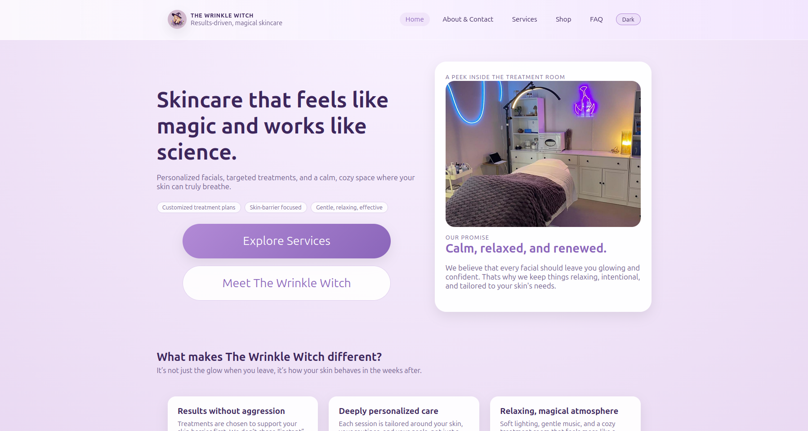

**Dark Mode Interface:** Alternative color scheme for improved user experience.  
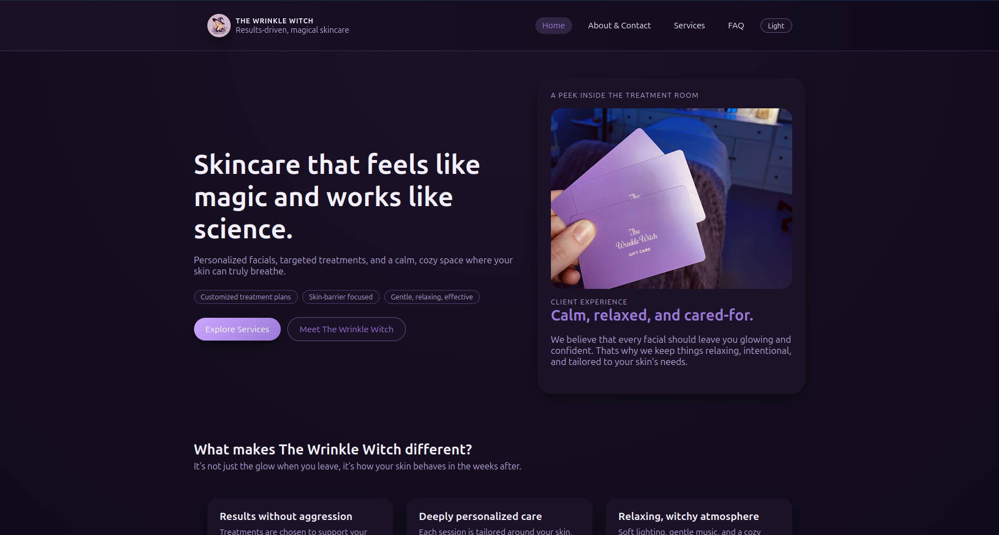

**FastAPI API Setup (CORS Middleware):** Core API configuration showing FastAPI initialization and `CORSMiddleware` setup for the production-facing service.  
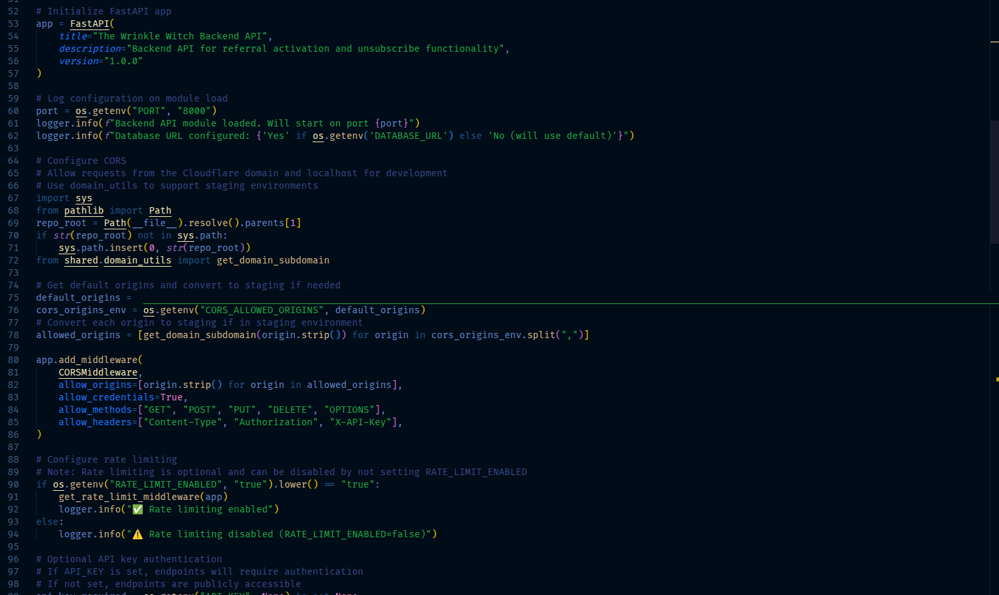

**FastAPI Docs (Specials Endpoints):** ReDoc view highlighting the Specials/Packages API surface used by the static site for dynamic homepage content.  
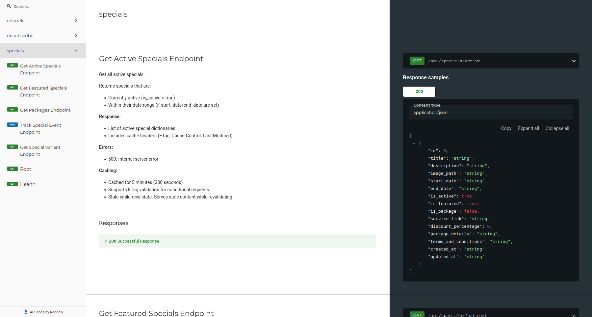

**Admin Specials Manager:** Streamlit admin UI for creating and managing specials/packages content (marketing engine).  
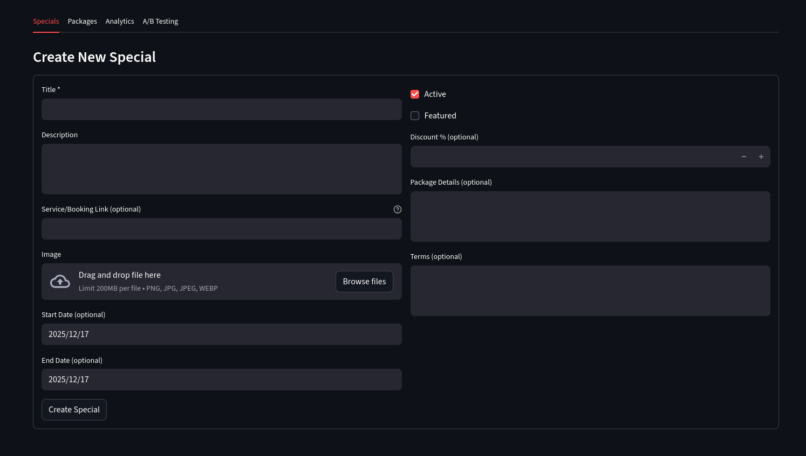

**Admin User Management:** Admin-only UI for user management, supporting role-based access and bcrypt-backed authentication.  
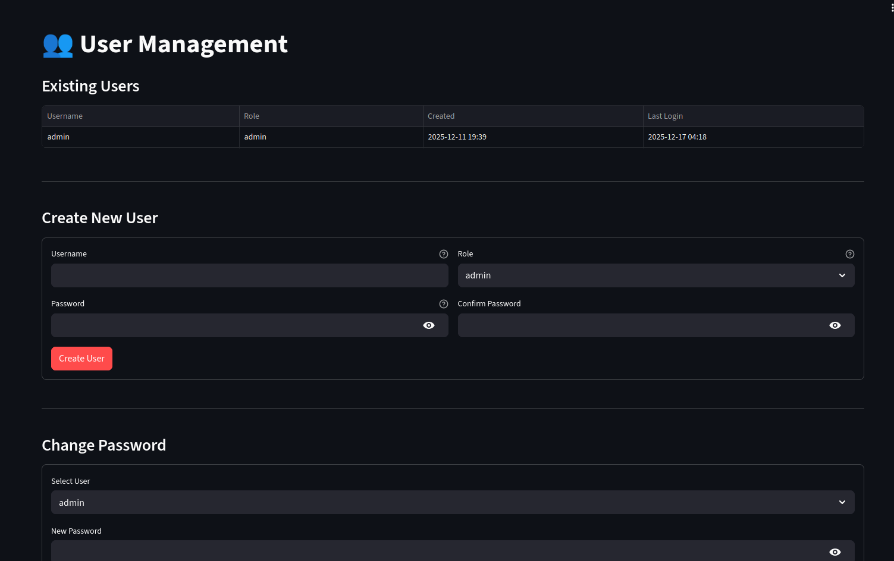

**Manual Referral Entry:** Customer-facing referral flow with manual code entry fallback when a QR code is unavailable.  
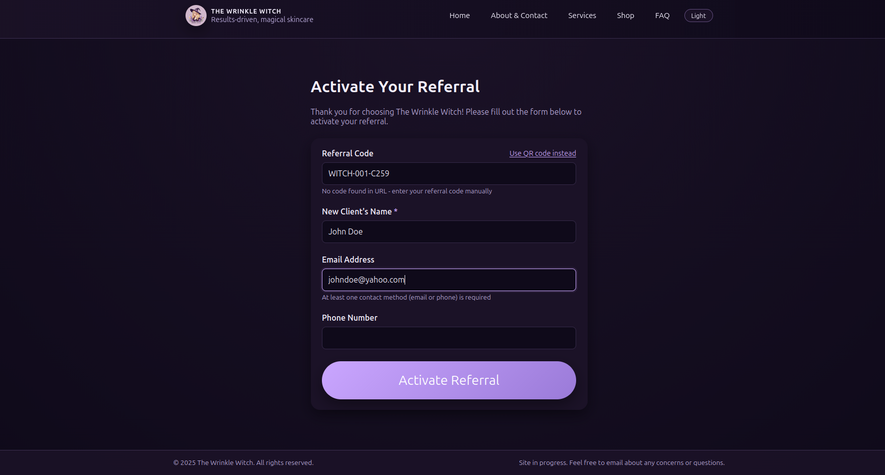

**Referral Success State:** Confirmation/status messaging after a referral code is successfully processed.  
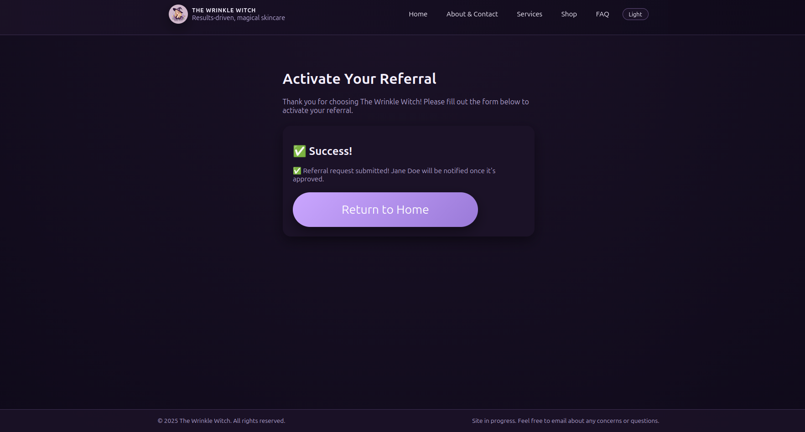

**Booking Flow – Secure Your Appointment (Step 4):** Card step in the multi-step booking flow on `booking.html` (Square Web Payments SDK).  
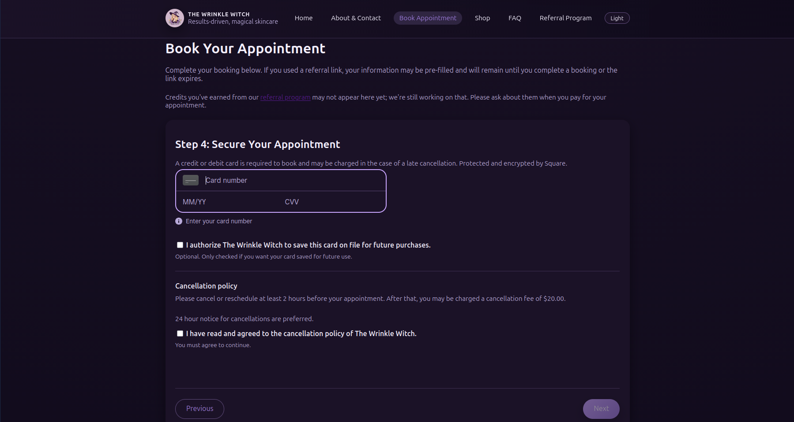

**Referral Program Page:** Top section of the customer-facing `referral-program.html` page.  
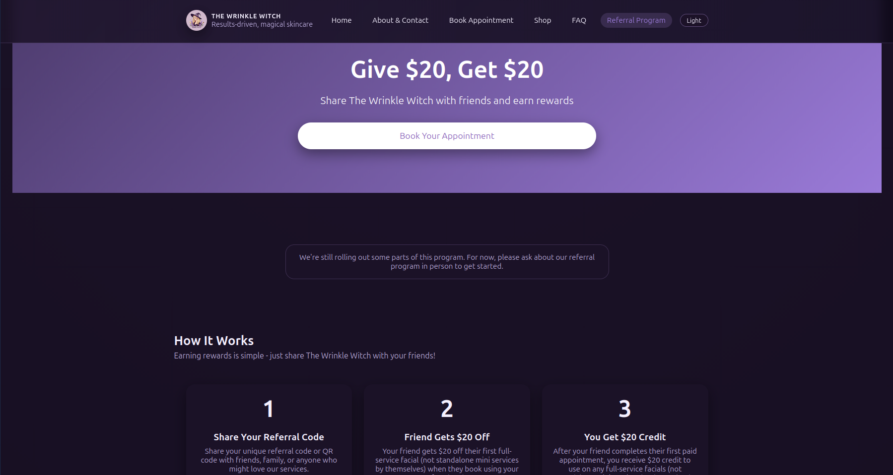

**Referral Management (Admin):** Streamlit admin interface for managing and tracking referrals (Clients listed are test clients, not actual clients).  
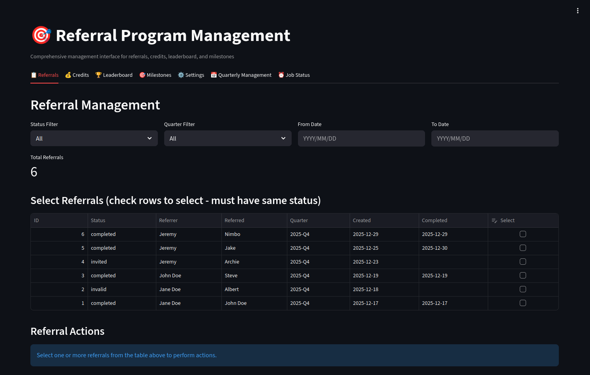

---

## Highlights

- Unified platform: static site, FastAPI backend, Streamlit admin apps, and scheduled jobs in one monorepo.
- Square Bookings and Web Payments SDK power online appointment booking with optional card-on-file and referral credit support.
- Referral program: event-based status, two-sided rewards, milestones, quarterly leaderboard/prizes, booking tokens, and fraud checks.
- Job dashboard and maintenance messaging keep operations visible without blocking the site.
- Clean, maintainable architecture; real-world use with evolving business needs.

---

## Repository

The codebase is private due to business content, but this page represents a comprehensive summary.
A summarized showcase of the platform is available in the portfolio README:  
[jeremyb-py.github.io/JeremyB-pydev_Portfolio](https://jeremyb-py.github.io/JeremyB-pydev_Portfolio/)

---

## Skills Demonstrated

- Full-stack system design (static frontend + API backend + admin apps + scheduled jobs)
- Modular monorepo architecture with shared utilities
- FastAPI + Uvicorn services; Pydantic validation; CORS, rate limiting, and structured errors
- Payment and booking flows (Square Bookings API, Web Payments SDK, tokenization)
- SQLAlchemy modeling + practical production/CI debugging
- Secure auth patterns (bcrypt hashing, roles, admin tooling)
- API integration patterns (Square OAuth refactor + adapter interfaces)
- Performance optimization (ETag/conditional GET, HTTP caching + resilient frontend fetching)
- Marketing/analytics engineering (specials engine, tracking, A/B testing groundwork)
- JavaScript & responsive static UI (multi-step booking, theme toggle, slideshows)
- Cloudflare Pages (static site) + Railway (API, cron jobs, apscheduler/croniter)
- pytest & GitHub Actions CI (path-filtered pipelines, import-order and DB fixtures)
- QR codes, branded URLs, and customer-facing HTML flows (referral, unsubscribe)
- SEO & ops hygiene (robots.txt, sitemap, security headers, logging)

---

## Next Steps

- Customer accounts (v1.5) with contact-based credit lookup and booking UX improvements
- Wire A/B test variant selection into the homepage slideshow fetch logic
- Self-serve reschedule/cancel for bookings (contact-based flow in place for now)
- Build the "Endorsed Products" system to power the Shop page dynamically
- Continue hardening multi-tenant patterns (business_id from auth context/subdomain)

---
